## 在其他手机上使用搜狗输入法小米版

[TOC]

从澎湃os提取一个安装包，签名是小米公司的，可以安装到其他小米手机上，也可以安装到其他品牌手机，但是在其他品牌手机安装后无法打开。

### 1.适配多品牌手机

修复其他手机无法打开小米输入法的问题

安装到其他手机上会有提示，

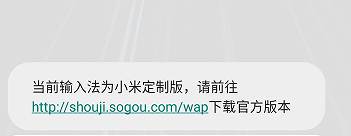

根据提示定位对应的字符串资源为ay7

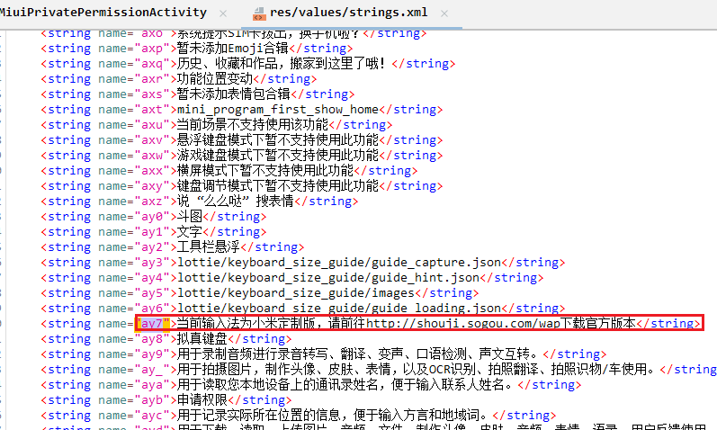

找到ay7被引用的地方，很明显是第一个，弹窗内容

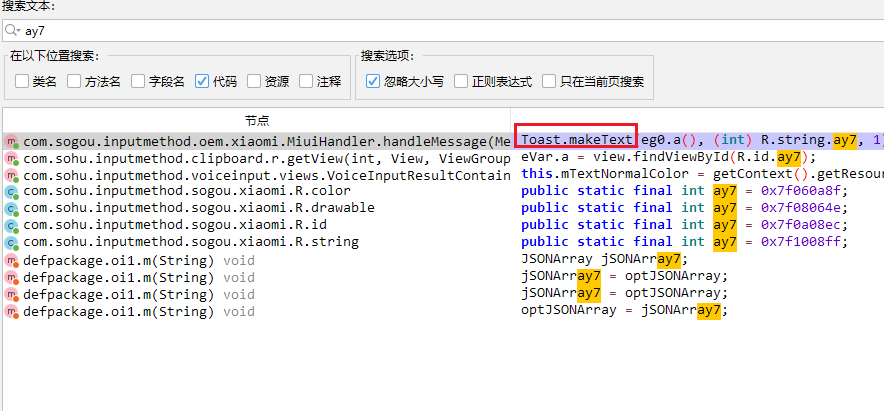

双击来到该代码处，是一个消息循环，那么需要有地方写消息，找一下实例化Miuihandle类的代码即可

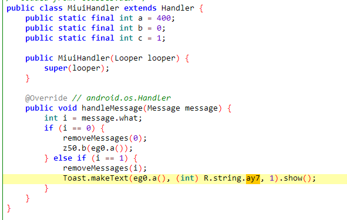

定位到com.sogou.inputmethod.oem.h类

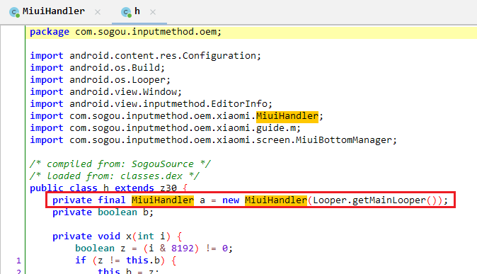

找一下是哪个类方法向消息循环发送了消息，有两处，j方法是发送1，r方法是发0

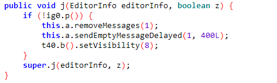

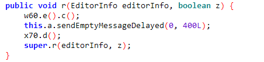

正常小米手机没弹窗肯定是没有发1，也就是跳过了这个!ig0.p()，那ig0.p()应该就是和厂商指纹相关的，来到p方法

绕过品牌限制就很简单了，法1就是int i2 = 1直接就返回true，法2就是false都改为true，法3就是上层if条件取反

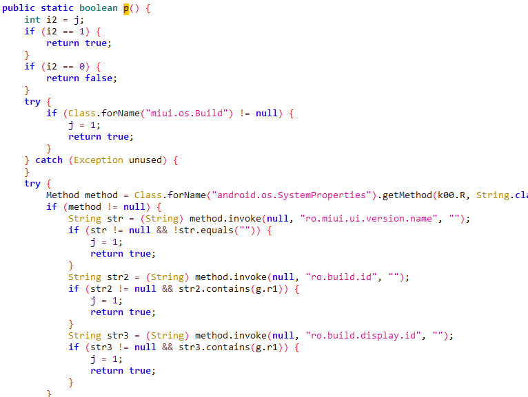

直接把这里全返回true即可绕过，再次安装使用

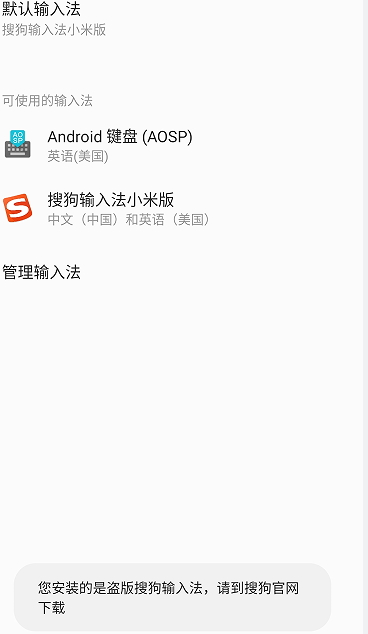

### 2.去签名校验

然后又显示“盗版”，继续定位字符串资源

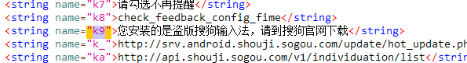

k9搜出来就比较多了，不好找。所以要直接搜R.string.k9，定位到com.sohu.inputmethod.engine

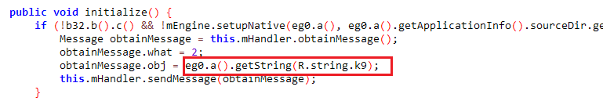

这里把if条件过了意义也不大，也没法正常打字。分析发现上图if中第一个条件恒为真，java层也只有第二个方法的声明，实现大概率在so层

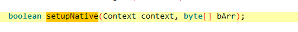

根据网上其他人的文章，这个函数在libsogouime.so中实现，直接用idapro看这个so，找到代码处。当然下次可能不是这个so，原理就是对普通搜狗调试，定位卡屏的so文件即可。

红色分支是修复打字的内容的部分，因此要执行红色部分就得改这个跳转。根据跳转条件，也就是说w0不能为0，直接mov w0,#1即可，用010editor把对应地址机器码改为20 00 80 52

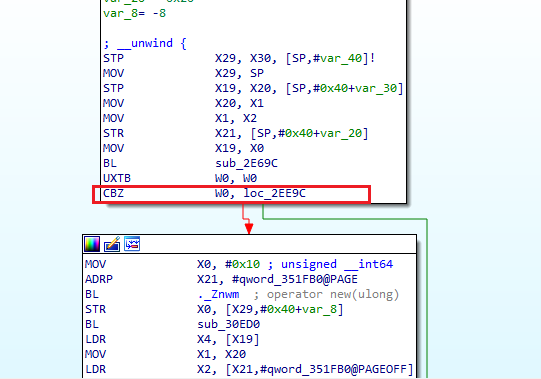

再次签名安装，其他手机也可以正常使用了


然而小米手机无法安装，即使通过adb强制卸载系统应用，也无法安装

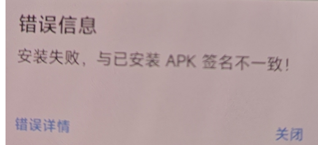

原因是com.sohu.inputmethod.sogou.xiaomi这个包名对应的签名写到了框架层，由系统动态检查签名，因此只能通过修改包名实现共存。

### 3.实现小米手机共存

通过MT管理器一键共存，又出问题了。

ui界面可以弹出，但是在设置界面点击“关于”，“输入设置”都会导致app闪退，应该是共存方案不完整。mt管理器非会员只能改一部分manifest.xml，用androidkiller替代即可。修改后其他品牌手机可以正常运行，可以使用表情和语音转文字

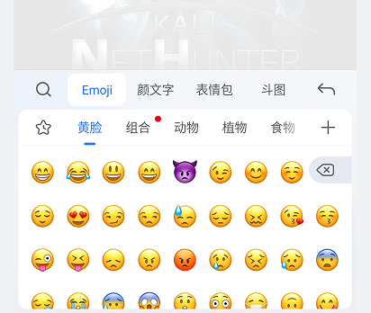

然而小米手机ui界面点表情和语音转文字这两个功能输入法就被自动切后台，设置页面只有一部分，还需要找原因。这个问题缺乏提示，很难一眼定位，去分析一下日志

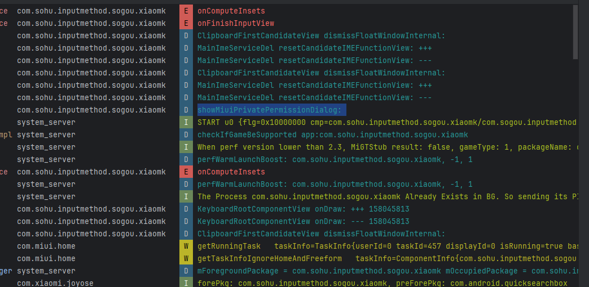

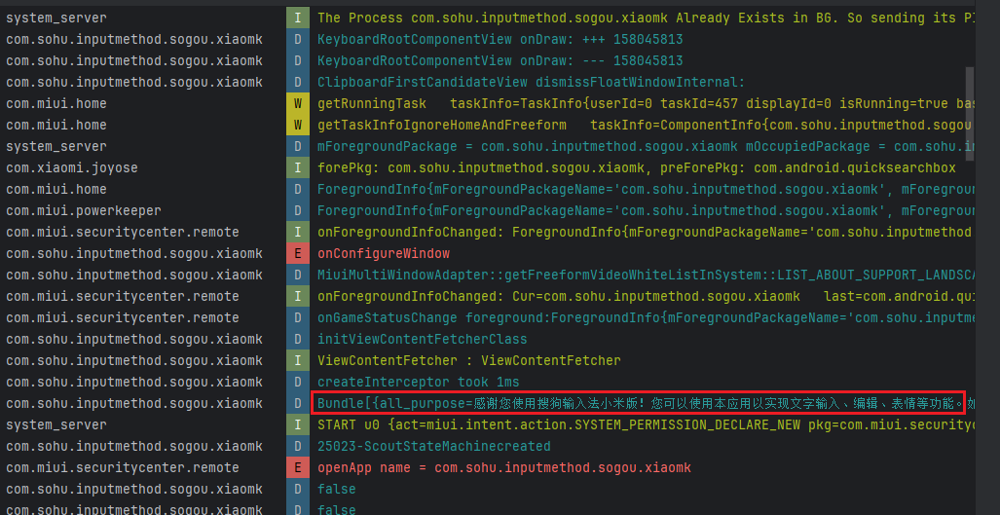

日志这里有一个bundle，通过前面的showMiuiprivatePermissiondialog分析，应该是miui要弹出一个独特的权限窗口，这个bundle就是权限页面的内容。

测试发现正常没有改包名的搜狗输入法小米版确实弹出了这个权限窗口，改了包名使得miui弹窗无法显示，从而导致前台应用失焦隐藏。通过对比其他品牌运行日志情况，其他品牌手机运行时并没有这个showdialog日志。那么肯定做了校验，检测miui，而且这个校验还不是之前的厂商指纹校验，不然非miui也会弹权限了，我们先用破解的思想：干掉校验。

由于日志的顺序性，我们可以从最先开始的showMiuiprivatePermissiondialog开始。破解的关键在于找到特征，现在字符串是最关键的特征，一定先去找字符串，找到字符串就往上回溯看看整个日志的调用链情况，其中重点关注调用栈中的if，就可以控制调用链的流程。

### 4.修复功能异常

4.1.有日志说明有地方写日志。

日志的包名不是系统，是我们自己的包名，那么我们就直接去app里面搜索写日志的地方，g方法就是写日志的

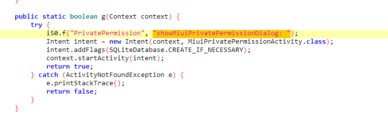

4.2.栈回溯思想，往上找

有了日志，说明有地方调用写日志的地方。非品牌手机没有showMiuiprivatePermissiondialog日志，说明还在上一层。继续往上找

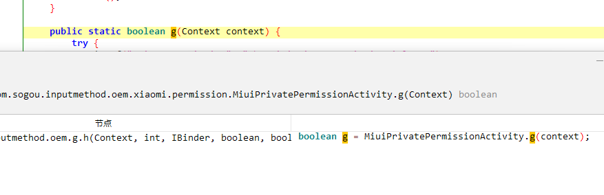

4.3.注意if

果然有地方调用这个，定位到com.sogou.inputmethod.oem.g.h方法，这个是在一个if之后的，if条件绝对十分重要，进到b方法看看

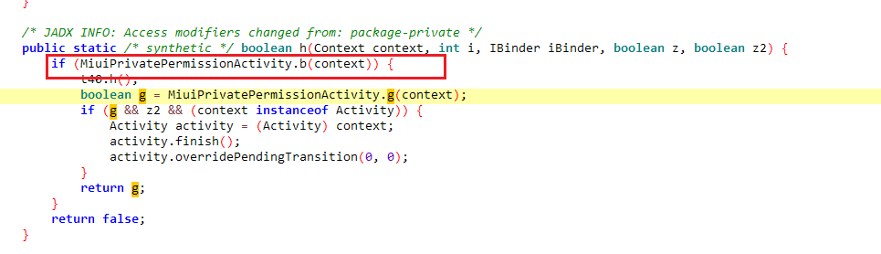

4.4.简单改动

果然，又是在校验miui，那么问题就迎刃而解了，直接把这里的两个字符串改掉，也就是在输入法中去除miui特征，使得app认为当前非miui系统，实测修改后在miui系统下即可正常使用。

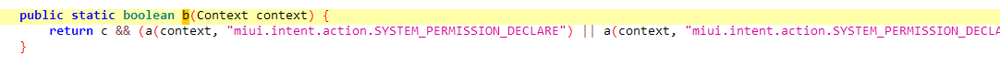

4.5.思考得与失

改变执行流程很简单的解决了一个问题，安全问题只有解决和没解决，解决就是好事。然而有了得要多思考失：修改了miui判定，后面可能数十个方法没有被执行，这样为miui做的优化全部丢失，且无法获取特殊权限。行百里者半九十，能用只算是完成50%目标。思考为什么弹窗没有出现？关键在于分析日志。

### 5.定位失焦问题

先定位不改包名时什么时候出现弹窗：bundle之后，因为弹窗的内容是bundle携带的，我们就去看一下bundle的内容，定位字符串就可以找到代码

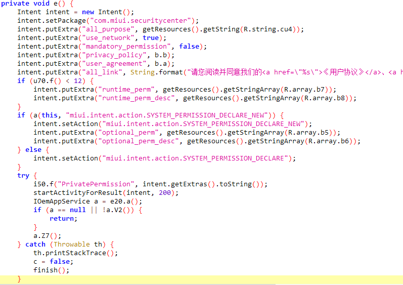

看了上面的代码，原因就清晰了，也就是APP发送了一个intent给到com.miui.securitycenter，这个intent是让安全中心启动一个activity，这个activity就是特殊权限页面，那我们就得看一下com.miui.securitycenter做了怎样的处理，直接看日志

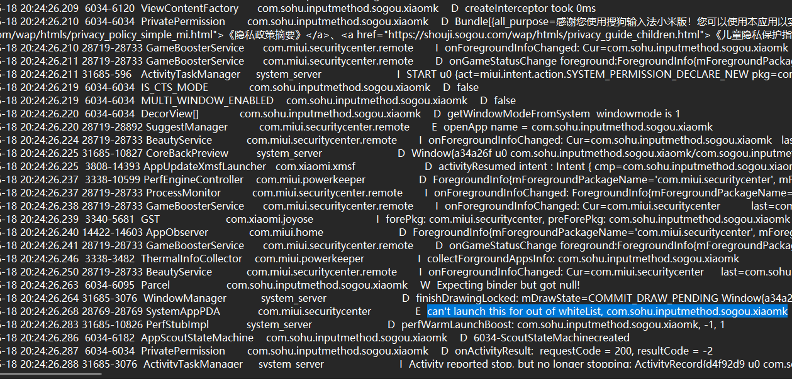

日志中确实有com.miui.securitycenter的返回信息：can't launch this for out of whiteList, com.sohu.inputmethod.sogou.xiaomk也就是说小米安全中心又做了校验，发现包名不是在白名单中，因此不给我们启动这个activity，因此导致了特殊权限页面没出来。终于定位到失焦的原因了，经过此番分析我们也发现miui版本的安全性和环境检查都比其他版本要好。

### 6.过安全中心

找到了问题那么我们简单分析一下com.miui.securitycenter，以便找到过安全检测的办法，过程略。

思路1.看一下miui安全中心的白名单有没有能够利用的包名，修改成那个包名 

思路2.修改com.miui.securitycenter，使得即使非白名单也走白名单流程。

先以思路2的视角分析com.miui.securitycenter，定位到下图代码处，过掉这个if，然后y0方法会给出权限页面。

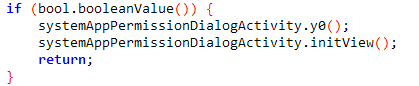

过掉后修改包名为com.miui.fakesecuritycenter，然后把intent发送到com.miui.fakesecuritycenter实现闭环。

对于思路1，通过分析小米安全中心找到对应的白名单包名即可。这里只给出三个，实际上有不少，但是大部分都为系统程序。

```xml
com.baidu.input_mi
com.sohu.inputmethod.sogou.xiaomi
com.iflytek.inputmethod.miui
```

实际操作上法1比较复杂，安全中心的共存需去除校验。而修改白名单包名相对简单，但是要注意到，如果包名对应的签名又在系统层校验，那该包名就无法使用。这里实测发现白名单包名确实可以过安全中心校验：

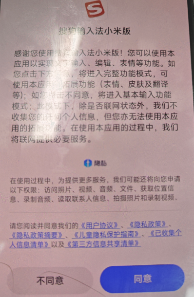

日志情况，可自行尝试。

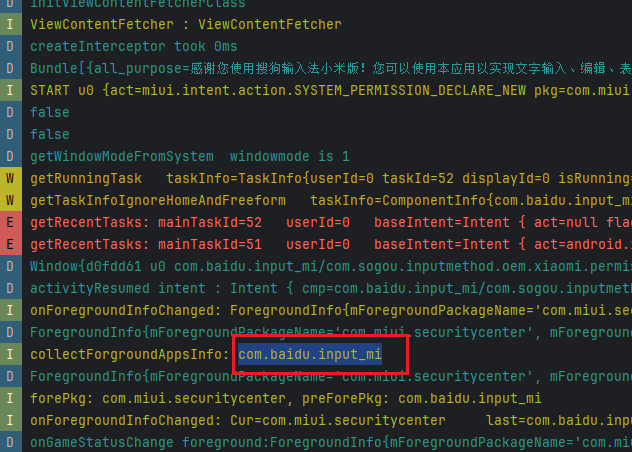