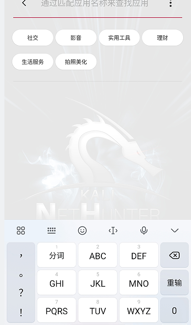

## 在其他手机上使用搜狗输入法小米版

[TOC]

从澎湃os提取一个安装包，签名是小米公司的，可以安装到其他小米手机上，也可以安装到其他品牌手机，但是在其他品牌手机安装后无法打开。

### 1.适配多品牌手机

修复其他手机无法打开小米输入法的问题

安装到其他手机上会有提示，


根据提示定位对应的字符串资源为ay7


找到ay7被引用的地方，很明显是第一个，弹窗内容


双击来到该代码处，是一个Handler，找一下实例化Miuihandle类的代码即可


定位到com.sogou.inputmethod.oem.h类


找一下是哪个方法向Handler发送了消息，有两处，j方法是发送1，r方法是发0


正常小米手机没弹窗肯定是没有发1，也就是跳过了这个!ig0.p()，那ig0.p()应该就是和厂商特征相关的，来到p方法

绕过品牌限制方法很多比如：法1就是int i2 = 1直接就返回true，法2就是false都改为true，法3就是上层if条件取反


直接把这里全返回true即可绕过，再次安装使用


### 2.去签名校验

然后又显示“盗版”，继续定位字符串资源


k9搜出来就比较多了，不好找。直接搜R.string.k9，定位到com.sohu.inputmethod.engine


这里把if条件过了意义也不大，签名校验在so层，不过so层签名校验没法正常打字。


根据网上其他人的文章，这个函数在libsogouime.so中实现，找到代码处。

红色分支是修复打字的内容的部分，因此要执行红色部分就得改这个跳转。根据跳转条件，也就是说w0不能为0，直接mov w0,#1即可，用010editor把对应地址机器码改为20 00 80 52


再次签名安装，其他手机也可以正常使用了



然而小米手机无法安装，即使通过adb强制卸载系统应用，也无法安装


可能是com.sohu.inputmethod.sogou.xiaomi这个包名对应的签名写到了系统中，只能通过修改包名实现共存。

### 3.实现小米手机共存

通过破解版MT管理器一键共存即可，修改后其他品牌手机可以正常运行，可以使用表情和语音转文字


然而小米手机ui界面点表情和语音转文字这两个功能输入法就被自动切后台，设置页面只有一部分，还需要找原因。这个问题缺乏提示，很难一眼定位，分析一下日志


日志这里有一个bundle，通过前面的showMiuiprivatePermissiondialog分析，应该是miui要弹出一个独特的权限窗口，这个bundle就是权限页面的内容。

测试发现正常没有改包名的搜狗输入法小米版确实弹出了这个权限窗口，改了包名miui弹窗无法显示，从而导致前台应用失焦隐藏。通过对比其他品牌运行日志情况，其他品牌手机运行时并没有这个showdialog日志。可能哪里做了校验，检测miui，还得想办法过了校验。

### 4.修复功能异常

4.1.找到打印日志的代码

直接去app里面搜索写日志的地方，g方法就是写日志的


4.2.寻找调用

非品牌手机没有showMiuiprivatePermissiondialog日志，说明会先进行某些判断，再调用g方法，继续往上找


4.3.找到h方法

定位到com.sogou.inputmethod.oem.g.h方法，if条件应该十分重要，进到b方法看看


4.4.修改

果然，又是在校验miui，那么问题就迎刃而解了，直接把这里的两个字符串改掉，实测修改后在miui系统下即可正常使用。


### 5.定位失焦问题

先定位不改包名时什么时候出现弹窗：bundle之后，因为弹窗的内容是bundle携带的，我们就去看一下bundle的内容，定位字符串就可以找到代码


看了上面的代码，原因就清晰了，也就是APP发送了一个intent给到com.miui.securitycenter，这个intent是让安全中心启动一个activity，这个activity就是特殊权限页面，那我们就得看一下com.miui.securitycenter做了怎样的处理，直接看日志


日志中确实有com.miui.securitycenter的返回信息：can't launch this for out of whiteList, com.sohu.inputmethod.sogou.xiaomk也就是说小米安全中心又做了校验，发现包名不是在白名单中，因此不给我们启动这个activity，因此导致了特殊权限页面没出来。

### 6.过安全中心

找到了问题那么我们简单分析一下com.miui.securitycenter，以便找到过安全检测的办法。通过分析小米安全中心找到对应的白名单包名即可。实际上有不少，但是大部分都为系统程序。

```xml
com.baidu.input_mi
com.sohu.inputmethod.sogou.xiaomi
com.iflytek.inputmethod.miui
```

实测发现白名单包名确实可以过安全中心校验：


修改后日志情况

